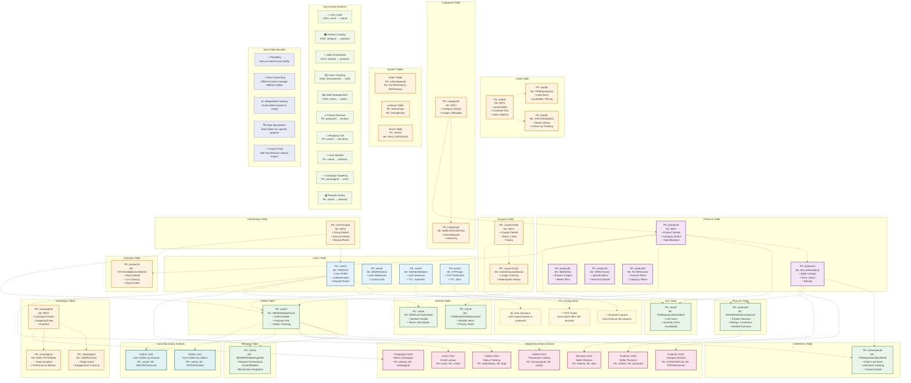

# DynamoDB Multi-Table Schema - Entity Relationship Diagram

```mermaid
graph TB
    %% Tables
    subgraph "Users Table"
        U1["PK: userid<br/>SK: PROFILE<br/>• User Profile<br/>• Authentication<br/>• Reward Points"]
        U2["PK: userid<br/>SK: ADDRESS#id<br/>• User Addresses<br/>• Contact Info"]
        U3["PK: userid<br/>SK: SESSION#token<br/>• User Sessions<br/>• TTL: expiresAt"]
        U4["PK: userid<br/>SK: OTP#type<br/>• OTP Verification<br/>• TTL: 300s"]
    end
    
    subgraph "Products Table"
        P1["PK: productId<br/>SK: INFO<br/>• Product Details<br/>• Category, Brand<br/>• Specifications"]
        P2["PK: productId<br/>SK: SELLER#sellerId<br/>• Seller Listings<br/>• Price, Stock<br/>• Ratings"]
        P3["PK: productId<br/>SK: IMAGE#id<br/>• Product Images<br/>• Media Files"]
        P4["PK: productId<br/>SK: SPEC#name<br/>• Specifications<br/>• Technical Details"]
        P5["PK: productId<br/>SK: FILTER#name<br/>• Search Filters<br/>• Category Filters"]
    end
    
    subgraph "Orders Table"
        O1["PK: userid<br/>SK: ORDER#date#txnId<br/>• Order Header<br/>• Payment Info<br/>• Status Tracking"]
    end
    
    subgraph "OrderItems Table"
        OI1["PK: transactionId<br/>SK: ITEM#productId#sellerId<br/>• Order Line Items<br/>• Individual Tracking<br/>• Courier Details"]
    end
    
    subgraph "Cart Table"
        C1["PK: userid<br/>SK: ITEM#productId#sellerId<br/>• Cart Items<br/>• Quantity, Price<br/>• Availability"]
    end
    
    subgraph "Wishlist Table"
        W1["PK: userid<br/>SK: WISHLIST#wishlistId<br/>• Wishlist Header<br/>• Name, Description"]
        W2["PK: userid<br/>SK: ITEM#wishlistId#productId<br/>• Wishlist Items<br/>• Priority, Notes"]
    end
    
    subgraph "Reviews Table"
        R1["PK: productId<br/>SK: REVIEW#date#reviewerId<br/>• Product Reviews<br/>• Ratings, Comments<br/>• Verified Purchase"]
    end
    
    subgraph "Rewards Table"
        RW1["PK: userid<br/>SK: REWARD#date#type#id<br/>• Reward Transactions<br/>• Earn/Redeem<br/>• Blockchain Integration"]
    end
    
    subgraph "Coupons Table"
        CP1["PK: couponCode<br/>SK: INFO<br/>• Coupon Details<br/>• Rules, Limits<br/>• Expiry"]
        CP2["PK: couponCode<br/>SK: USAGE#userid#txnId<br/>• Usage Tracking<br/>• Redemption History"]
    end
    
    subgraph "Campaigns Table"
        CA1["PK: campaignId<br/>SK: INFO<br/>• Campaign Details<br/>• Targeting Rules<br/>• Analytics"]
        CA2["PK: campaignId<br/>SK: USER#userid<br/>• Target Users<br/>• Engagement Tracking"]
        CA3["PK: campaignId<br/>SK: ANALYTICS#date<br/>• Daily Analytics<br/>• Performance Metrics"]
    end
    
    subgraph "Leads Table"
        L1["PK: leadId<br/>SK: INFO<br/>• Lead Details<br/>• Customer Info<br/>• Sales Pipeline"]
        L2["PK: leadId<br/>SK: ITEM#productId<br/>• Lead Items<br/>• Quantities, Pricing"]
        L3["PK: leadId<br/>SK: STATUS#date#id<br/>• Status History<br/>• Follow-up Tracking"]
    end
    
    subgraph "Categories Table"
        CT1["PK: categoryId<br/>SK: INFO<br/>• Category Details<br/>• Images, Metadata"]
        CT2["PK: categoryId<br/>SK: SUBCATEGORY#id<br/>• Subcategories<br/>• Hierarchy"]
    end
    
    subgraph "Inventory Table"
        I1["PK: productId<br/>SK: STOCK#lotBatch#sellerId<br/>• Stock Details<br/>• Lot Tracking<br/>• Expiry Dates"]
    end
    
    subgraph "UserGroups Table"
        UG1["PK: userGroupId<br/>SK: INFO<br/>• Group Details<br/>• Discount Rules<br/>• Reward Rates"]
    end
    
    subgraph "System Tables"
        S1["Filters Table<br/>PK: subcategoryId<br/>SK: FILTER#name | DATA#value"]
        S2["Lookups Table<br/>PK: lookupType<br/>SK: lookupName"]
        S3["Terms Table<br/>PK: termId<br/>SK: INFO | DETAIL#id"]
    end
    
    %% GSI Indexes
    subgraph "Global Secondary Indexes"
        GSI1["Users GSI1<br/>Email Lookup<br/>PK: email, SK: userid"]
        GSI2["Products GSI1<br/>Category Browse<br/>PK: CATEGORY#id, SK: PRICE#amount"]
        GSI3["Products GSI2<br/>Seller Products<br/>PK: sellerId, SK: productId"]
        GSI4["Orders GSI1<br/>Transaction Lookup<br/>PK: transactionId, SK: userid"]
        GSI5["Orders GSI2<br/>Status Tracking<br/>PK: orderStatus, SK: date"]
        GSI6["Reviews GSI1<br/>Seller Reviews<br/>PK: sellerId, SK: date"]
        GSI7["Campaigns GSI1<br/>Seller Campaigns<br/>PK: sellerId, SK: campaignId"]
    end
    
    %% LSI Indexes
    subgraph "Local Secondary Indexes"
        LSI1["Orders LSI1<br/>User Orders by Status<br/>PK: userid, SK: STATUS#status"]
        LSI2["Orders LSI2<br/>User Orders by Amount<br/>PK: userid, SK: AMOUNT#amount"]
    end
    
    %% Access Patterns
    subgraph "Key Access Patterns"
        AP1["🔐 User Login<br/>GSI1: email → userid"]
        AP2["🛍️ Product Catalog<br/>GSI2: category → products"]
        AP3["👤 Seller Dashboard<br/>GSI3: sellerId → products"]
        AP4["📦 Order Tracking<br/>GSI4: transactionId → order"]
        AP5["📊 Order Management<br/>GSI5: status → orders"]
        AP6["⭐ Product Reviews<br/>PK: productId → reviews"]
        AP7["🛒 Shopping Cart<br/>PK: userid → cart items"]
        AP8["💝 User Wishlist<br/>PK: userid → wishlists"]
        AP9["🎯 Campaign Targeting<br/>PK: campaignId → users"]
        AP10["💰 Reward History<br/>PK: userid → rewards"]
    end
    
    %% Data Flow Relationships
    U1 -.-> O1
    U1 -.-> C1
    U1 -.-> W1
    U1 -.-> RW1
    
    P1 -.-> P2
    P1 -.-> C1
    P1 -.-> W2
    P1 -.-> R1
    P1 -.-> I1
    
    O1 -.-> OI1
    O1 -.-> RW1
    
    P2 -.-> OI1
    P2 -.-> R1
    
    CP1 -.-> CP2
    CP2 -.-> O1
    
    CA1 -.-> CA2
    CA1 -.-> CA3
    
    L1 -.-> L2
    L1 -.-> L3
    
    CT1 -.-> CT2
    CT1 -.-> P1
    
    UG1 -.-> U1
    UG1 -.-> O1
    
    %% GSI Connections
    U1 -.-> GSI1
    P2 -.-> GSI2
    P2 -.-> GSI3
    O1 -.-> GSI4
    O1 -.-> GSI5
    R1 -.-> GSI6
    CA1 -.-> GSI7
    
    %% LSI Connections
    O1 -.-> LSI1
    O1 -.-> LSI2
    
    %% TTL Configuration
    subgraph "TTL Configuration"
        TTL1["🕐 User Sessions<br/>Auto-expire based on expiresAt"]
        TTL2["🔐 OTP Codes<br/>Auto-expire after 300 seconds"]
        TTL3["🎫 Expired Coupons<br/>Auto-cleanup old coupons"]
    end
    
    U3 -.-> TTL1
    U4 -.-> TTL2
    CP1 -.-> TTL3
    
    %% Design Benefits
    subgraph "Multi-Table Benefits"
        B1["🔧 Flexibility<br/>Easy to extend and modify"]
        B2["👥 Team Ownership<br/>Different teams manage different tables"]
        B3["📈 Independent Scaling<br/>Scale tables based on usage"]
        B4["🔍 Clear Boundaries<br/>Each table has specific purpose"]
        B5["🚀 Future-Proof<br/>Add new features without impact"]
    end
    
    %% Styling
    classDef userTable fill:#e3f2fd,stroke:#1976d2,stroke-width:2px
    classDef productTable fill:#f3e5f5,stroke:#7b1fa2,stroke-width:2px
    classDef orderTable fill:#e8f5e8,stroke:#388e3c,stroke-width:2px
    classDef systemTable fill:#fff3e0,stroke:#f57c00,stroke-width:2px
    classDef gsiIndex fill:#fce4ec,stroke:#c2185b,stroke-width:2px
    classDef lsiIndex fill:#e0f2f1,stroke:#00695c,stroke-width:2px
    classDef accessPattern fill:#f1f8e9,stroke:#558b2f,stroke-width:1px
    classDef benefit fill:#e8eaf6,stroke:#3f51b5,stroke-width:1px
    classDef ttl fill:#fff8e1,stroke:#ff8f00,stroke-width:1px
    
    class U1,U2,U3,U4 userTable
    class P1,P2,P3,P4,P5 productTable
    class O1,OI1,C1,W1,W2,R1,RW1 orderTable
    class CP1,CP2,CA1,CA2,CA3,L1,L2,L3,CT1,CT2,I1,UG1,S1,S2,S3 systemTable
    class GSI1,GSI2,GSI3,GSI4,GSI5,GSI6,GSI7 gsiIndex
    class LSI1,LSI2 lsiIndex
    class AP1,AP2,AP3,AP4,AP5,AP6,AP7,AP8,AP9,AP10 accessPattern
    class B1,B2,B3,B4,B5 benefit
    class TTL1,TTL2,TTL3 ttl
```
