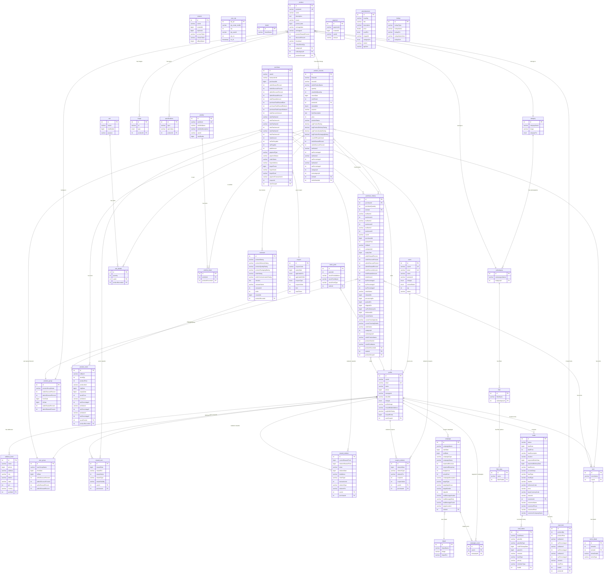

# E-commerce Database Schema - Entity Relationship Diagram

```mermaid
erDiagram
    %% User Management
    users {
        int id PK
        varchar userid UK
        varchar email UK
        varchar name
        varchar password
        enum roletype
        enum currentStatus
        int otp
        varchar status
    }
    
    profile {
        int id PK
        varchar userid
        varchar email UK
        varchar name
        bigint phone
        varchar managerId
        varchar aboutMe
        enum roletype
        varchar profileImage
        varchar rewardWalletAddress
        decimal avgSellerRating
        bigint rewardPoints
        int userGroupId FK
    }
    
    address_book {
        int id PK
        varchar name
        bigint phone
        varchar address
        varchar city
        varchar district
        varchar state
        int pin
        varchar country
        int profileId FK
    }
    
    user_group {
        int id PK
        varchar userGroupName
        bigint fromDate
        bigint toDate
        int sellerDiscountPercent
        int adminDiscountPercent
        int sellerRewardPercent
        int adminRewardPercent
    }
    
    session {
        int id PK
        varchar userid
        bigint createdAt
        bigint expiresAt
        varchar accessToken
        varchar refreshToken
        tinyint isBlacklisted
    }
    
    user_otp {
        int otp_pk PK
        varchar otp_email_mobile
        int otp
        varchar otp_userid
        int otp_no
        timestamp crt_dt
    }
    
    %% Product Catalog
    category {
        int id PK
        varchar categoryName
        varchar image
        enum categoryFor
    }
    
    subcategory {
        int id PK
        varchar subcategoryName
        int categoryId FK
    }
    
    brand {
        int id PK
        varchar brandName
    }
    
    product_group {
        int id PK
        varchar productGroupName
        int sellerDiscountPercent
        int adminDiscountPercent
        bigint fromDate
        bigint toDate
        int sellerRewardPercent
        int adminRewardPercent
    }
    
    product {
        int id PK
        varchar productId UK
        varchar name
        text description
        varchar brand
        bigint posted_date
        varchar arimagedata
        varchar arimageurl
        int productRewardPercent
        int discountPercent
        varchar thumbnail
        int criticalStockQty
        int categoryId FK
        int subcategoryId FK
        int productGroupId FK
    }
    
    product_records {
        int id PK
        varchar ParentId
        varchar recordId
        varchar sellerProductName
        int quantity
        int unsettledQuantity
        bigint returnDate
        int rentPeriod
        int productId FK
        tinyint isAvailable
        varchar purpose
        text itemDescription
        int price
        varchar productStatus
        decimal avgProductRating
        decimal avgProductDeliveryRating
        decimal avgProductQualityRating
        decimal avgProductPackagingRating
        int countOfPeopleVoted
        int sellerRewardPercent
        int sellerDiscountPercent
        varchar taxName1
        int taxPercentage1
        varchar taxName2
        int taxPercentage2
        varchar taxName3
        int taxPercentage3
        int categoryId
        int subcategoryId
        int termsId FK
        int sellerDetailsId FK
    }
    
    stock_point {
        int id PK
        int parentId
        varchar stockPointAddress
        varchar stockPointName
        varchar stockPointType
        int sellerId FK
    }
    
    product_stock {
        int id PK
        varchar lotBatch
        int stockQty
        int productPrice
        varchar productUnit
        bigint mfgDate
        bigint expiryDate
        int stockPrice
        varchar taxName1
        int taxPercentage1
        varchar taxName2
        int taxPercentage2
        varchar taxName3
        int taxPercentage3
        int stockPointId FK
        int productRecordsId FK
    }
    
    image {
        int id PK
        varchar url
        enum type
        int productId FK
    }
    
    specifications {
        int id PK
        varchar spec
        varchar specValue
        int productId FK
    }
    
    %% Orders & Purchases
    purchase {
        int id PK
        varchar userid
        varchar transactionId
        bigint purchasedAt
        int sellerRewardPercent
        int sellerDiscountPercent
        int adminDiscountPercent
        int adminRewardPercent
        int totalRewardAmount
        int purchaseTotalRewardEarn
        int purchaseTotalRewardRedeem
        int purchaseTotalCouponRedeem
        int totalDiscountAmount
        varchar totalTaxName1
        int totalTaxAmount1
        varchar totalTaxName2
        int totalTaxAmount2
        varchar totalTaxName3
        int totalTaxAmount3
        int totalAmount
        int netTaxPayable
        int netPayable
        int paidAmount
        varchar paymentType
        varchar paymentStatus
        varchar orderStatus
        varchar buyerAddress
        bigint buyerPhone
        varchar buyerName
        varchar buyerEmail
        varchar paymentTransactionId
        int couponId FK
        int userGroupId FK
    }
    
    purchase_history {
        int id PK
        int purchaseId FK
        int purchaseQuantity
        int termsId FK
        varchar taxName1
        int taxAmount1
        varchar taxName2
        int taxAmount2
        varchar taxName3
        int taxAmount3
        varchar userid
        bigint purchasedAt
        int productPrice
        varchar lotBatch
        int stockpointId
        bigint expiryDate
        int sellerRewardPercent
        int sellerDiscountPercent
        int adminDiscountPercent
        int adminRewardPercent
        int totalDiscountAmount
        int totalRewardAmount
        int totalAmount
        int taxPercentage1
        int taxPercentage2
        int taxPercentage3
        varchar orderStatus
        bigint initiatedOn
        bigint processingOn
        bigint packedOn
        bigint shippedOn
        bigint outForDeliveryOn
        bigint deliveredOn
        varchar courierName
        varchar courierTrackingCode
        varchar courierTrackingDetails
        varchar sellerName
        int categoryId
        int subcategoryId
        varchar sellerProductName
        int productStockId
        varchar stockPointName
        int productRecordsId FK
        int sellerId FK
        int productGroupId FK
    }
    
    payment {
        int id PK
        varchar paymentId
        bigint createdAt
        varchar userId
        varchar amount
    }
    
    %% Shopping Experience
    cart {
        int id PK
        varchar userid
        bigint modifiedAt
        varchar purpose
    }
    
    cart_details {
        int id PK
        int quantity
        int cartId FK
        int productRecordsId FK
    }
    
    wishlist {
        int id PK
        varchar wishlistId UK
        varchar wishlistName
        varchar wishlistDescription
        varchar userid
        bigint modifiedAt
    }
    
    wishlist_detail {
        int id PK
        int wishlistId FK
        int productRecordsId FK
    }
    
    comment {
        int id PK
        varchar productRating
        varchar productDeliveryRating
        varchar productQualityRating
        varchar productPackagingRating
        varchar sellerRating
        varchar sellerCommunicationRating
        text remarks
        varchar reviewerName
        int reviewerId
        int seller
        bigint createdAt
        int productRecordId FK
    }
    
    %% Rewards & Promotions
    reward_earn {
        int id PK
        bigint rewardDate
        varchar rewardFor
        int rewardValue
        varchar rewardType
        varchar rewardValidity
        int userId FK
        int purchaseId FK
    }
    
    reward_redeem {
        int id PK
        bigint currentRewardPoint
        bigint redeemRewardPoint
        varchar token
        bigint redeemDate
        varchar toAddress
        varchar chainType
        int transactionId
        varchar redeemType
        varchar redeemFor
        int userId FK
        int purchaseId FK
    }
    
    coupon {
        int id PK
        varchar couponCode
        bigint expiryDate
        enum applicableFor
        int applicableRefId
        enum couponType
        int couponValue
        int limit
        int usedTimes
    }
    
    coupon_redeem {
        int id PK
        bigint redeemDate
        varchar redeemType
        varchar redeemFor
        int couponId
        int couponValue
        int userId FK
        int purchaseId FK
    }
    
    %% Marketing & Campaigns
    clipart {
        int id PK
        varchar clipartName
        varchar image
        varchar clipartFor
    }
    
    campaign {
        int id PK
        varchar campaignName
        bigint startDate
        bigint endDate
        varchar campaignType
        varchar campaignStatus
        int expectedRevenue
        int expectedResponse
        int budgetCost
        int actualCost
        varchar campaignDescription
        varchar targetType
        varchar targetAgeGroup
        varchar targetGender
        int clipartId FK
        varchar mailMessageHeader
        varchar mailMessageBody
        varchar mailMessageFooter
        varchar targetLocation
        int sellerId FK
    }
    
    campaign_users {
        int id PK
        int userId FK
        int campaignId FK
    }
    
    advertisement {
        int id PK
        varchar heading
        varchar title
        varchar description
        double price
        enum usedFor
        varchar imageUrl
        enum categoryFor
        varchar linkUrl
        varchar bgColor
    }
    
    %% CRM & Lead Management
    leads {
        int id PK
        varchar status
        bigint leadDate
        int leadPrice
        varchar leadDescription
        varchar location
        bigint expectedOrderDate
        bigint expectedDeliveryDate
        varchar leadSource
        varchar currentSetup
        varchar leadType
        varchar fundType
        varchar leadNo
        varchar referenceCode
        varchar zone
        varchar baseCurrencyCode
        varchar ownerId
        int customerId FK
        varchar customerName
        varchar customerPhone
        varchar customerEmail
        varchar customerCompanyName
    }
    
    lead_status {
        int id PK
        varchar leadStatus
        varchar givenBy
        varchar givenByType
        bigint nextFollowupDate
        bigint givenOn
        varchar remarks
        varchar leadType
        varchar priority
        varchar reminderType
        int leadId FK
    }
    
    lead_item {
        int id PK
        int productQty
        int productPrice
        varchar taxName1
        int taxPercentage1
        varchar taxName2
        int taxPercentage2
        varchar taxName3
        int taxPercentage3
        varchar remarks
        int totalPrice
        int leadId FK
        int productId FK
    }
    
    %% System Configuration
    filter {
        int id PK
        varchar filterName
        int subcategoryId FK
    }
    
    filter_data {
        int id PK
        varchar name
        int filterFieldId FK
    }
    
    lookup {
        int id PK
        varchar lookupType
        varchar lookupName
        varchar lookupFor
        varchar lookupNameView
        int lookupSort
    }
    
    term {
        int id PK
        varchar termsName
        int userId FK
    }
    
    terms_detail {
        int id PK
        int termsNo
        int termsId FK
        varchar termsDetails
        varchar termsType
    }
    
    %% Relationships
    users ||--|| profile : "one-to-one"
    profile ||--o{ address_book : "has addresses"
    profile }o--|| user_group : "belongs to"
    
    category ||--o{ subcategory : "has subcategories"
    subcategory ||--o{ filter : "has filters"
    filter ||--o{ filter_data : "has filter options"
    
    product }o--|| category : "belongs to"
    product }o--|| subcategory : "belongs to"
    product }o--|| product_group : "belongs to"
    product ||--o{ product_records : "has seller listings"
    product ||--o{ image : "has images"
    product ||--o{ specifications : "has specs"
    product ||--o{ lead_item : "in lead items"
    
    product_records }o--|| profile : "seller"
    product_records }o--|| term : "has terms"
    product_records ||--o{ product_stock : "has stock"
    product_records ||--o{ cart_details : "in cart"
    product_records ||--o{ wishlist_detail : "in wishlist"
    product_records ||--o{ comment : "has reviews"
    product_records ||--o{ purchase_history : "in purchases"
    
    stock_point ||--o{ product_stock : "stores stock"
    stock_point }o--|| profile : "owned by seller"
    
    purchase }o--|| coupon : "uses coupon"
    purchase }o--|| user_group : "user group discount"
    purchase ||--o{ purchase_history : "has items"
    purchase ||--o{ reward_earn : "earns rewards"
    purchase ||--o{ reward_redeem : "redeems rewards"
    purchase ||--o{ coupon_redeem : "redeems coupons"
    
    cart ||--o{ cart_details : "has items"
    wishlist ||--o{ wishlist_detail : "has items"
    
    profile ||--o{ reward_earn : "earns rewards"
    profile ||--o{ reward_redeem : "redeems rewards"
    profile ||--o{ coupon_redeem : "redeems coupons"
    profile ||--o{ campaign : "creates campaigns"
    profile ||--o{ campaign_users : "targeted in campaigns"
    profile ||--o{ leads : "customer"
    profile ||--o{ term : "creates terms"
    
    campaign }o--|| clipart : "uses clipart"
    campaign ||--o{ campaign_users : "targets users"
    
    leads ||--o{ lead_status : "has status history"
    leads ||--o{ lead_item : "has items"
    
    term ||--o{ terms_detail : "has details"
    
    purchase_history }o--|| term : "has terms"
    purchase_history }o--|| profile : "seller"
    purchase_history }o--|| product_group : "product group"
```
